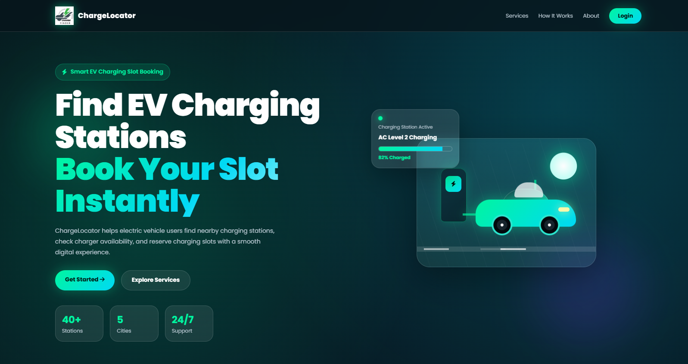
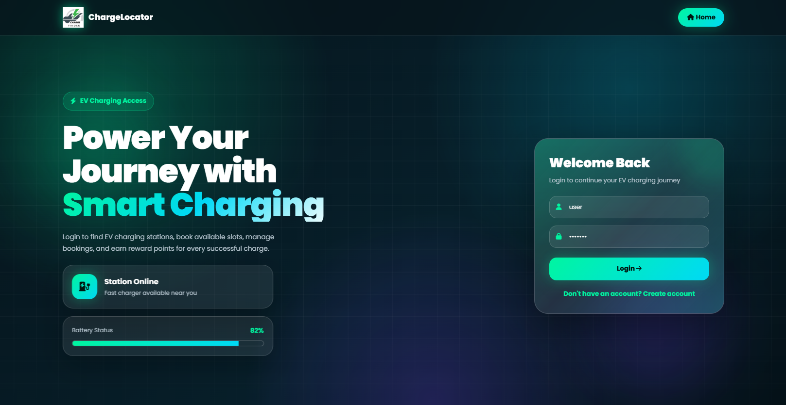
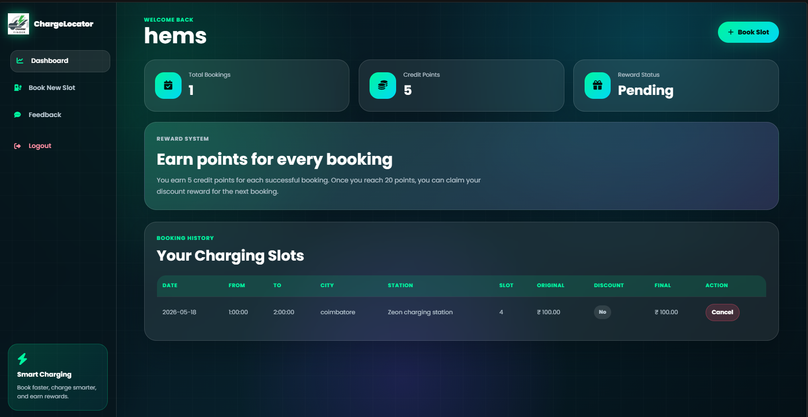
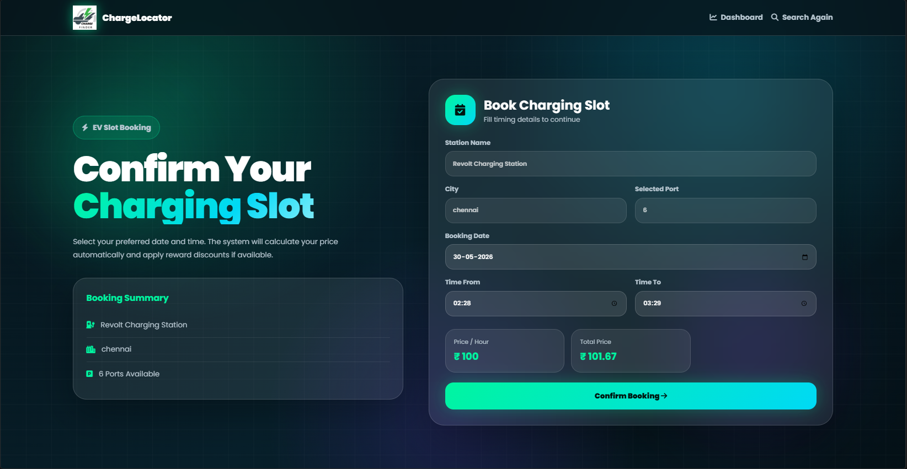
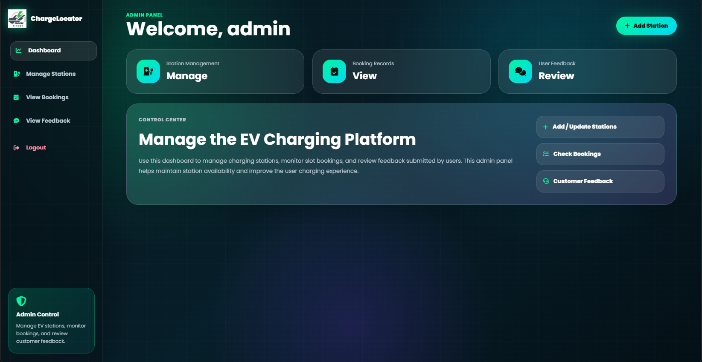

# ChargeLocator – EV Charging Station Finder & Booking System

ChargeLocator is a web-based Electric Vehicle (EV) Charging Station Finder and Slot Booking System developed using Flask and MySQL. The application helps EV users locate nearby charging stations, check charger availability, and book charging slots efficiently through a user-friendly interface.

---

## Features

### User Features
- User registration and secure login
- Search charging stations by city and charger type
- View charging station details
- Book charging slots
- View booking history
- Feedback and contact form
- Credit points and reward discount system

### Admin Features
- Admin dashboard
- Add and manage charging stations
- View user bookings
- Manage station availability
- View user feedback

---

## Technologies Used

| Technology | Purpose |
|------------|---------|
| Python Flask | Backend Framework |
| MySQL | Database Management |
| HTML | Frontend Structure |
| CSS | Styling |
| JavaScript | Frontend Interactivity |

---

## Project Structure

```text
ChargeLocator/
│
├── app.py
├── DBConnection.py
├── requirements.txt
├── database.sql
├── templates/
├── static/
├── screenshots/
└── README.md
```

---

## Installation & Setup

### Step 1: Clone the Repository

```bash
git clone https://github.com/hemshema03/charlocator-ev-chargingstation-finder.git
```

### Step 2: Navigate to Project Folder

```bash
cd charlocator-ev-chargingstation-finder
```

### Step 3: Create Virtual Environment

```bash
python -m venv venv
```

### Step 4: Activate Virtual Environment

#### Windows

```bash
venv\Scripts\activate
```

---

## Database Setup

### Step 1: Install MySQL

Install:
- MySQL Server
- MySQL Workbench

Official Download:
https://dev.mysql.com/downloads/installer/

---

### Step 2: Import Database

Open MySQL Workbench and execute:

```text
database.sql
```

OR

Go to:

```text
Server → Data Import
```

Choose:

```text
Import from Self-Contained File
```

Select:

```text
database.sql
```

Click:

```text
Start Import
```

---

### Step 3: Verify Database

Ensure database name is:

```text
ev_db4
```

---

### Step 4: Configure Database Connection

Open:

```text
DBConnection.py
```

Update MySQL credentials if required:

```python
self.cnx = mysql.connector.connect(
    host="localhost",
    user="root",
    password="your_mysql_password",
    database="ev_db4"
)
```

---

## Install Required Packages

```bash
pip install -r requirements.txt
```

---

## Run the Application

```bash
python app.py
```

Open browser:

```text
http://127.0.0.1:5000
```

---

## Project Screenshots

### Home Page


### Login Page


### User Dashboard


### Booking Form


### Admin panel



---
## 👨‍💻 Future Enhancements

- 🗺 Live Google Maps Integration
- 📡 Real-Time Slot Availability
- 💳 Online Payment Gateway
- 📱 Mobile App Version
- 🔔 Notification System
- 📍 GPS Nearby Charger Detection
- ⚡ AI-Based Charger Recommendation
- 🌎 Public EV Charging API Integration

---

## 👨‍💻 Developed By

### Hemachandran M

Passionate Full Stack Developer focused on building futuristic and user-friendly applications.

---

## ⭐ Support

If you like this project:

⭐ Star this repository  
🍴 Fork this project  
🚀 Follow for more futuristic projects