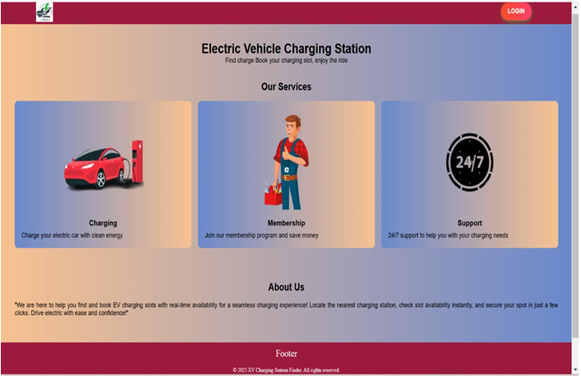
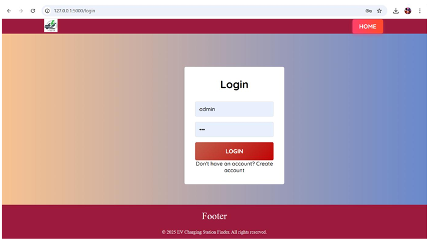
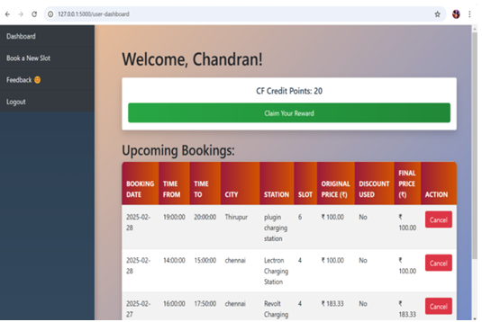
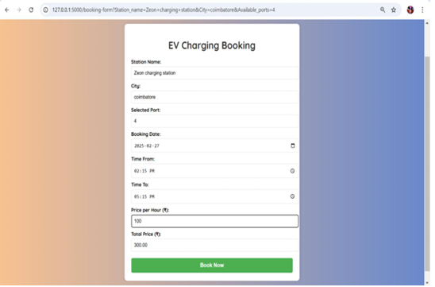
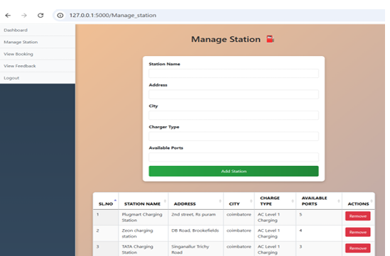

# ChargeLocator

ChargeLocator is a Flask + MySQL web application for finding EV charging stations and booking charging slots.

## Features

- User registration and login
- Admin dashboard
- Manage charging stations
- Search charging stations by city and charger type
- Book charging slots
- View bookings
- Feedback/contact form
- Credit points and reward discount system

## Tech Stack

- Python Flask
- MySQL
- HTML, CSS, JavaScript

## Setup

1. Create a virtual environment:

```bash
python -m venv venv
```

2. Activate the virtual environment:

Windows:

```bash
venv\Scripts\activate
```

3. Install requirements:

```bash
pip install -r requirements.txt
```

4. Create the database in MySQL:

```bash
mysql -u root -p < database.sql
```

5. Configure environment variables. Copy `.env.example` to `.env` and update your MySQL username/password.

6. Run the project:

```bash
python app.py
```

Open: http://127.0.0.1:5000

## Default Login

## Screenshots

### Home Page


### Login Page


### User Dashboard


### Booking Form


### Admin Panel


## Author

Hemachandran M